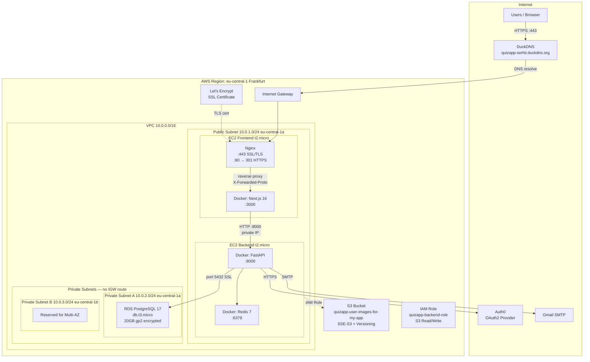

# QuizApp — AWS Infrastructure (Terraform)

## Architecture



### Request Flow

```
Browser → HTTPS → DuckDNS DNS → EIP 63.181.102.187
  → Nginx (:443 SSL termination)
    → Next.js (:3000 reverse proxy)
      → FastAPI (:8000 private IP 10.0.1.25)
        → RDS PostgreSQL (:5432 private subnet)
        → Redis (:6379 Docker sidecar)
        → S3 (IAM Role, presigned URLs)
```

### Security Groups

```
Frontend SG: 80, 443, 3000 ← 0.0.0.0/0  |  22 ← my IP only
Backend SG:  8000 ← Frontend SG only     |  22 ← my IP only
RDS SG:      5432 ← Backend SG only
```

---

## AWS Resources

| Resource         | Type                      | Name                           |
| ---------------- | ------------------------- | ------------------------------ |
| VPC              | 10.0.0.0/16               | quizapp-vpc                    |
| Public Subnet    | 10.0.1.0/24               | quizapp-public-subnet          |
| Private Subnet A | 10.0.2.0/24               | quizapp-private-subnet-a       |
| Private Subnet B | 10.0.3.0/24               | quizapp-private-subnet-b       |
| EC2 Frontend     | t2.micro (30GB gp3)       | quizapp-frontend               |
| EC2 Backend      | t2.micro (30GB gp3)       | quizapp-backend                |
| RDS              | db.t3.micro PostgreSQL 17 | quizapp-postgres               |
| S3               | Versioning + SSE-S3       | quizapp-user-images-for-my-app |
| Redis            | Docker (redis:7-alpine)   | Container on Backend EC2       |

---

## Endpoints & IPs

| Item                | Value                                                             |
| ------------------- | ----------------------------------------------------------------- |
| **App URL**         | https://quizapp-serhii.duckdns.org                                |
| **Frontend EIP**    | 63.181.102.187                                                    |
| **Backend EIP**     | 3.78.65.156 (SSH only)                                            |
| **Backend Priv IP** | 10.0.1.25 (FE→BE)                                                |
| **RDS Endpoint**    | quizapp-postgres.c9cgygesmbda.eu-central-1.rds.amazonaws.com:5432 |
| **S3 Bucket**       | quizapp-user-images-for-my-app                                    |
| **SSH Key**         | ``~/.ssh/quizapp-key``                                            |
| **Region**          | eu-central-1 (Frankfurt)                                          |

---

## Prerequisites

```powershell
terraform --version   # >= 1.0
aws --version         # AWS CLI v2

aws configure         # Access Key, Secret Key, region: eu-central-1

ssh-keygen -t ed25519 -f ~/.ssh/quizapp-key -N ""
```

---

## Terraform Usage

```powershell
cd terraform

# First deploy
cp terraform.tfvars.example terraform.tfvars   # Fill: my_ip, db_password, s3_bucket_name
terraform init
terraform plan
terraform apply

# Update
terraform plan
terraform apply

# Destroy everything
terraform destroy

# Useful commands
terraform output
terraform state list
terraform fmt
terraform validate
```

---

## SSH

```powershell
ssh -i ~/.ssh/quizapp-key ec2-user@63.181.102.187    # Frontend
ssh -i ~/.ssh/quizapp-key ec2-user@3.78.65.156        # Backend
```

If SSH fails — your ISP may have changed your IP:

```powershell
(Invoke-WebRequest -Uri "https://api.ipify.org").Content   # Check current IP
# Update my_ip in terraform.tfvars, then: terraform apply
```

---

## Operations

### Deploy code

```powershell
# Backend
ssh -i ~/.ssh/quizapp-key ec2-user@3.78.65.156 "cd ~/back-end && git pull origin develop && sudo /usr/local/bin/docker-compose -f docker-compose.prod.yml up -d --build"

# Frontend
ssh -i ~/.ssh/quizapp-key ec2-user@63.181.102.187 "cd ~/front-end && git pull origin FE-18-Implement-AWS-Structure && cd quizapp && sudo /usr/local/bin/docker-compose -f docker-compose.prod.yml up -d --build"
```

### Docker management (on EC2)

```bash
sudo docker ps                                    # Container status
sudo docker logs quizapp-backend --tail 100 -f    # Backend logs
sudo docker logs quizapp-frontend --tail 100 -f   # Frontend logs

# Restart
cd ~/back-end  # or ~/front-end/quizapp
sudo /usr/local/bin/docker-compose -f docker-compose.prod.yml restart

# Rebuild
sudo /usr/local/bin/docker-compose -f docker-compose.prod.yml up -d --build

# Cleanup disk space
sudo docker system prune -a -f
# WARNING: Do NOT run ``docker volume prune`` — Redis data lives there
```

### Database migrations

```bash
sudo docker exec -it quizapp-backend bash
alembic current
alembic upgrade head
```

### Stop/Start infrastructure (save costs)

```powershell
# Stop
aws ec2 stop-instances --region eu-central-1 --instance-ids i-03473f0121c0f28e3 i-012f219f0cdd3161c
aws rds stop-db-instance --region eu-central-1 --db-instance-identifier quizapp-postgres

# Start
aws ec2 start-instances --region eu-central-1 --instance-ids i-03473f0121c0f28e3 i-012f219f0cdd3161c
aws rds start-db-instance --region eu-central-1 --db-instance-identifier quizapp-postgres
# Wait ~2 min (EC2) and ~5-10 min (RDS). Containers auto-start (restart: unless-stopped).
```

> **Note:** Idle EIPs cost ~$0.005/hr each. RDS auto-starts after 7 days if stopped.

---

## Costs (Free Tier — first year)

| Resource | Free Tier              | Our Usage          | Cost                |
| -------- | ---------------------- | ------------------ | ------------------- |
| EC2      | 750 hrs/mo t2.micro    | 2 × 24/7 = 1440h  | ~$6-8/mo (690 over) |
| RDS      | 750 hrs/mo db.t3.micro | 1 × 24/7 = 720h   | $0                  |
| S3       | 5 GB                   | Minimal            | $0                  |
| EIP      | Free while attached    | 2 EIPs             | $0 (when running)   |

After Free Tier: ~$30-50/mo total.

---

## Troubleshooting

| Problem | Solution |
| ------- | -------- |
| SSH timeout | ISP changed your IP. Update ``my_ip`` in ``terraform.tfvars``, run ``terraform apply`` |
| Backend "Restarting" | RDS not ready yet. Wait 5-10 min after starting RDS |
| Frontend OOM on build | Enable 2GB swap: ``sudo fallocate -l 2G /swapfile && sudo chmod 600 /swapfile && sudo mkswap /swapfile && sudo swapon /swapfile`` |
| RDS connection failed | Check ``aws rds describe-db-instances`` status. Verify ``.env`` POSTGRES_HOST on Backend EC2 |
| Git auth on EC2 | ``git remote set-url origin https://ghp_TOKEN@github.com/He-llo-Wo-rld/REPO.git`` |

---

## File Structure

```
terraform/
├── main.tf                 # Provider, data sources
├── network.tf              # VPC, Subnets, IGW, Route Tables
├── security.tf             # Security Groups (firewall rules)
├── compute.tf              # EC2, EIP, SSH Key Pair
├── database.tf             # RDS PostgreSQL
├── storage.tf              # S3 Bucket
├── iam.tf                  # IAM Role (Backend → S3 access)
├── variables.tf            # Input variables
├── outputs.tf              # Output values
├── terraform.tfvars        # Secret values (NEVER commit!)
├── terraform.tfvars.example
└── scripts/
    ├── setup-frontend.sh   # EC2 user_data (Docker, Git)
    └── setup-backend.sh    # EC2 user_data (Docker, Git)
```
